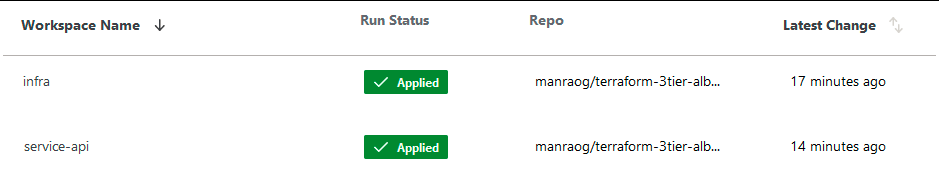
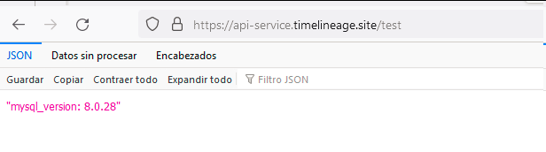

# terraform-3tier-alb-ecs-rds
This repository contains a Terraform project that creates an ECS cluster with Fargate, exposes services from ECS using ALB, and creates an RDS database, all using a 3-tier network architecture.

## Branching strategy
To keep it simple, this repository just uses main branch. This branch is connected to Terraform Cloud, so there are no GitHub Actions workflows applying Terraform commands, all this occurs on Terraform Cloud.


If more people is working on this projects is recomended to use Trunk Based Development Strategy but without release branches, since we are creating a single environment right now.


> ℹ️ We can use later Terraform Workspaces or different folders to provision other environments and better structure the project, and use Github Actions leveraging [Terraform Cloud Action](https://developer.hashicorp.com/terraform/tutorials/automation/github-actions) to create a better flow, for example: use GitHub Actions Approvals or create GitHub Releases once a change is applied to prod.

The main branch can be protected and introduce changes to the main branch with Pull Requests. Some Github Actions checks can be run on the Terraform project, like [AquaSecurity Trivy](https://github.com/aquasecurity/trivy) or [tflint](https://github.com/terraform-linters/tflint). This improves the quality and security without requiring too much manual review. The rules of the scanners can be modified as needed.

## Terraform Cloud
To make this project I used a Terraform Cloud Free tier.

#### Connection to Github

The connection between Terraform Cloud and Github was made using Terraform's Github App, following this documentation: https://developer.hashicorp.com/terraform/cloud-docs/vcs/github-app

#### Connection to AWS


*Image from AWS Blog

The connection between Terraform Cloud and AWS was made using OpenID Connect, so Terraform Cloud can assume an IAM Role on AWS without requiring to generate and rotate Access Keys. The configuration was made following this documentation: https://aws.amazon.com/es/blogs/apn/simplify-and-secure-terraform-workflows-on-aws-with-dynamic-provider-credentials/

> ℹ️ For a quick setup I mostly used AWS-managed policies, but for better security, we can create our own policies like the ones I created for Parameter Store.

The IAM role created for Terraform Cloud is called _terraform-cloud-role_ and it has the following AWS-managed policies:
- ElasticLoadBalancingFullAccess
- AmazonVPCFullAccess
- AmazonRDSFullAccess
- AmazonECS_FullAccess
- AmazonRoute53FullAccess
- AWSCertificateManagerFullAccess
- IAMFullAccess

I also made some user-managed policies:
- ParameterStoreFullAccess

```json
{
    "Version": "2012-10-17",
    "Statement": [
        {
            "Sid": "ParameterStoreFullAccess",
            "Effect": "Allow",
            "Action": [
                "ssm:PutParameter",
                "ssm:LabelParameterVersion",
                "ssm:DeleteParameter",
                "ssm:DescribeParameters",
                "ssm:GetParameterHistory",
                "ssm:GetParametersByPath",
                "ssm:GetParameters",
                "ssm:GetParameter",
                "ssm:DeleteParameters",
                "ssm:AddTagsToResource",
                "ssm:ListTagsForResource"
            ],
            "Resource": "*"
        }
    ]
}
```

We will need to set up the following environment variables. The AWS Terraform provider needs these to know which role is going to be use to apply changes.


#### Directories and workspaces

This repository contains 3 directories:

- infra: _This is where all infrastructure is created and some values are exported. I chosed to use a single ALB since is cheaper_
- services: _This is where services or APIS that use the infrastructure are defined, this helps isolate services state from infrastructure state  
    - api: _This creates an ECS service that connects to RDS MySQL an returns it's version_
    - others: _Other services can be created inside services directory following a structure similar to api example, they can use the same load balancer but with a different subdomain, listener rule and target group. More load balancers can be created as needed._
- code: _This directory contains the code used by the ECS services. The code is published to Docker Hub (free) with a Github Actions workflow_
    - api: _This directoy contains the coude used to create the image runned by the ECS api service. It connects to MySQL an return it's version_
    - others: _code for other services can be placed here_

There are 2 Terraforms Cloud workspaces:
- infra: 
    - branch: main
    - directory: infra
- services-api:
    - banch: main
    - directory: services/api



## Gitub Actions

There is a Github Actions workflow to build and push the Docker Image used in this project.

https://hub.docker.com/repository/docker/raog/ecs-api-service/general

The workflow is simple:
- Linter
- Docker Build
- Docker Push

It's posible to use Cloud Native Buildpacks for this simple aplicacion instead of Dockerfiles. https://buildpacks.io/

The code is a _Python FastAPI_ application. Just returns _MySQL_ version when a _GET_ request is made to _/test_:



## Route53 and ALB

I had a Hosted Zone so the project don't create one, just uses and existing Hosted Zone.

New services can be added to the same ALB, they just need to create a new target group, listener rule, ecs task and ecs service.

I'ts cheaper than use an ALB per services, but the disadvantage is when the ALB don't work, all services are down and metrics ands logs are mixed for all services, it requires good monitoring a logs.

There is a wild card certificate to be used for in all services.

_*.basedomain.example_

## VPC

VPC is a 3 tier network

- public subnets
    - AZ1
    - AZ2
- private ecs subnets with acces to internet
    - AZ1
    - AZ2
- private db subnets **without** access to internet
    - AZ1
    - AZ2

## RDS

The RDS instance is very simple and small since its a more expensive service.

Only _sys_ database is used.

## ECS

ECS is using fargate to avoid manage EC2 instances.

I had problems connecting to RDS so I enabled ECS Exec to run command inside container:

https://docs.aws.amazon.com/AmazonECS/latest/developerguide/ecs-exec.html


---------------

## Improvements

There are some improvements that can be made to this project:

1. Convert services directoy/api to a module and maybe use some community terraform modules to simplify infra directory.
2. Separate code, ECS services and Infrastructure to differente repositories.
3. Use TLS between ALB and ECS Service, even when AWS Docs says that al traffic inside VPC is encrypted, some standars require TLS inside the VPC. Others like PCI DSS requires mutual TLS.
4. Change Docker Hub to ECR and only allow to deploy signed images to ECS.
5. Once ECR has replaced Docker Hub, use VPC Endpoints if ECS services don't require to use Internet services. VPC Endpoint are cheaper than NAT Gateway.
6. Use IAM authentication with RDS on ECS Tasks instead of user and password.
7. User Network ACL as an extra layer of security to limit communication from public subnet to db subnets, only allow comunication from public subnets to ecs subnets and from ecs subnets to db subnetes.
8. Add HTTP to HTTPS redirection on ALB.
9. Red parameters from Parameter Store directly with code (values can be chached to reduce cost). This avoids the need to recreate ECS Tasks when a Parameter is modified.
10. Add an auto scaling group
11. Use Cloud Native Buildpacks, it can covers most scenarios without requiring a Dockerfile

---------------
### References:
- https://developer.hashicorp.com/terraform/cloud-docs/vcs/github-app
- https://www.hashicorp.com/resources/a-practitioner-s-guide-to-using-hashicorp-terraform-cloud-with-github
- https://aws.amazon.com/es/blogs/apn/simplify-and-secure-terraform-workflows-on-aws-with-dynamic-provider-credentials/
